## 前言
本文档为我于22赛季中调试全向轮步兵的一些经验及思路。在我本人作为新队员接触机器人初，对于如此大的工程代码我无所适从，但还是硬着头皮小到一行公式、一个函数，大到一个任务一个工程慢慢去啃，要凭自己看源码一步步去了解（当然也请教了大佬）其整个工程、每个任务的控制逻辑及大量控制算法并不容易。为了减少各位花在啃源码和熟悉机器人电控的时间与精力，将更多时间放于优化和创新上，我写下关于自己调试步兵机器人的一些经验及对一些代码的解释望能够帮助各位更快消化和入门。本文档只是作为参考，主要自行理解为主，建议各位和[全向轮源码](https://e.coding.net/jxlgdx/jxlgdx-mcu-c-example/L_C-Board.git)一起看。  

## 底盘任务
步兵机器人的底盘由四个M3508电机驱动控制，底盘任务作为最基本任务，控制逻辑比较多而复杂，因为需要进行功率限制、多个模式切换、轮子运动的解算等。考虑到各位初入电控，前面篇幅稍多。  

### 阅读代码
初看project，我相信各位无从下手，一方面我们很难再看见简单的变量命名，取而代之的是各种结构体成员、宏定义和指针；一方面一个project有很多的文件夹，文件夹分有多个文件（[谈嵌入式软件分层设计](https://blog.csdn.net/wenxiHuang/article/details/78946256) ）。一个文件一般有大量的函数，而一个任务的控制逻辑中必然会有各种函数的调用。为此我分享一下我是如何看源码的。  

熟悉代码的步骤是以task为核，task有头文件和源文件，从头文件开始看起。头文件有：包含的头文件、宏定义变量、结构体、函数声明等。我们主要看的就是宏定义和结构体。宏定义和结构体可以体现该task的属性，继而大致了解到该任务要做什么。如下代码部分是一个电机结构体，该结构体包含了电机需要或潜在需要用到的属性，我们可以看到有加速度、速度、PID、电机原始数据和设定电流，可以知道它是负责移动的电机结构体。同样，当知道一个任务是干什么的，就可以联想其头文件中有什么属性，从而更好的了解一个task乃至其它文件。  

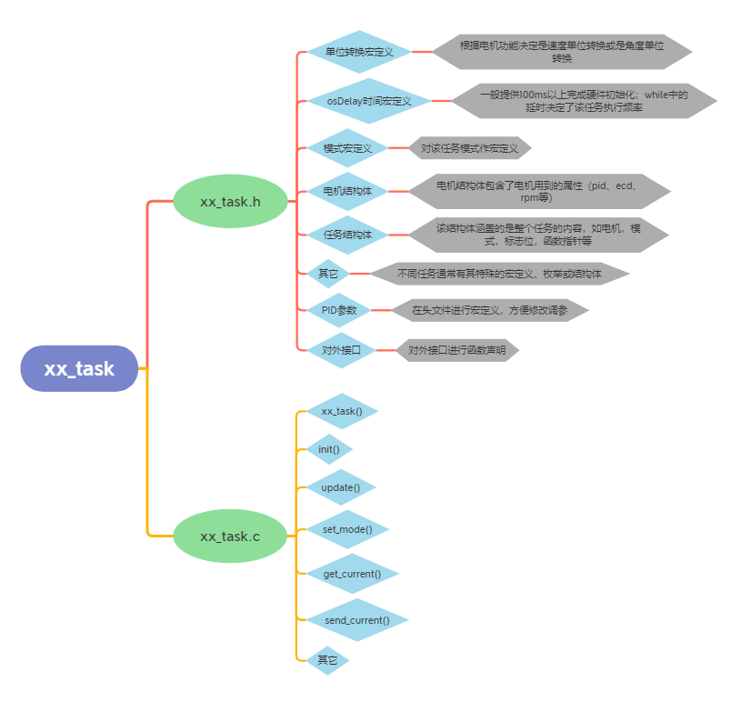

谨记：**创建的的变量要规范化，都要从名字知道其作用，是干什么的就用英文（非常不推荐拼音）；创建的任务要遵循一定的结构，做到功能模块化。具体如何还是要通过源码熟悉。**

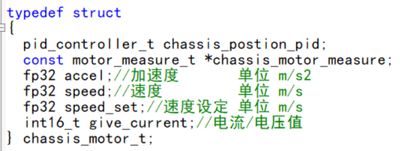

把头文件的代码大致了解之后，就可以开始源文件的阅读。源文件内容比较多，以chassis_task.c为例就有几十个（包括chassis_mode.c）。如果从上到下一行一行看，这不但效率低，而且容易忘记。因此我建议直接看任务函数，以其中的顺序为准，先了解整体再熟悉细节。总体基本就是机器人上电，初始化之后进入循环，实时（一个循环）更新当前模式，更新机器人数据（主要是速度），根据模式设置速度，根据设定速度更新给定电流。而后再去进每个函数具体理解。  

除了任务函数中调用的函数，还有大量负责具体某些功能的函数，这些函数被任务函数中函数所调用或间接调用，这些函数在调用它们的时候看，这样更熟悉其功能。  

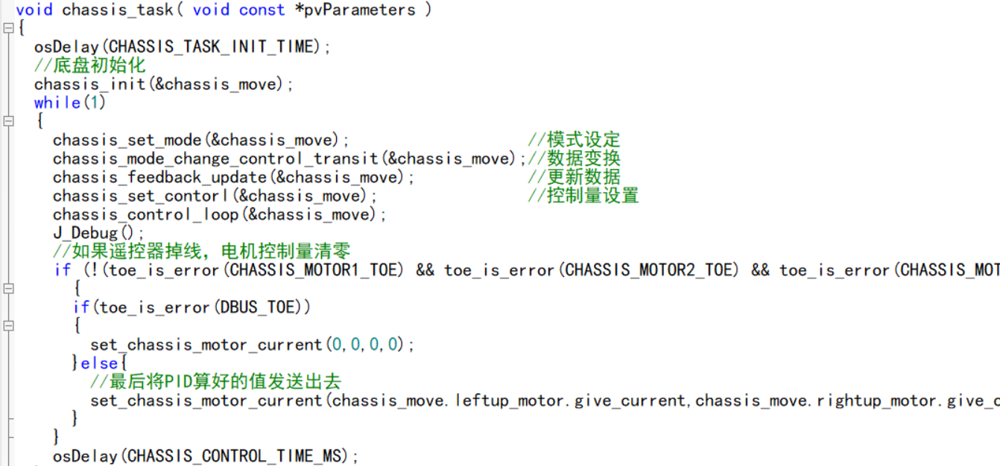

### 机器人控制
遥控器和键盘是控制机器人的工具，从代码角度可理解为设置速度、角度等和更新机器人模式。我们建立了一个dbus文件专门接收、解析从遥控器和键鼠传来的数据。  

如下，串口得到并解析后的数据放入RC_ctrl_t结构体中，具体如何解析请自行看dbus_task.c文件，结合我们对键盘鼠标和遥控器的认识可较容易熟悉这些数据。  

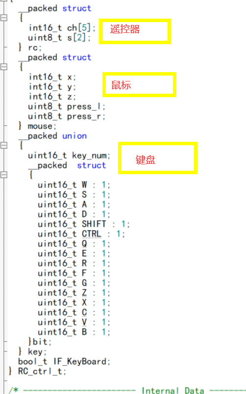

遥控器控制比较简单，只需了解rc中各个值对应DR16遥控器中的开关很容易上手。主要提一下键鼠控制。mouse对应为横向移动鼠标，纵向移动鼠标，滚轮，左键和右键，key结构体有16个按键可用。键鼠控制单独划分了文件keyboard。如何确定哪个键按下，键位状态（松开、按下、长按、短按）的判别算法也已经写好，推荐了解。    

如何通过键鼠控制？机器人控制主要在于移动、模式转换、射击等。相信大部分对fps有所了解，机器人控制同样遵循类似的操作。    

如下keyboard.c中的其中一个函数，负责的是超级电容开关功能。通过ctrl键的状态决定要干什么,具体需要干什么就需要写好该功能对应的接口函数，如下super_cap_ON（）等。   

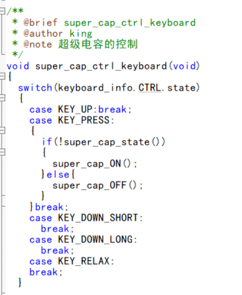

### CAN通信
数据通信对机器人来说必不可少，常用到CAN、串口通信等。其中CAN通信用于电机与控制板数据通信，二者之间会遵循一套通信协议保证传输可靠性。CAN通信具体内容不再细说，主要有以下主要的点。    
 
1. 长度和电机个数一致。如下该函数是2006电机电流发送函数，一个电机，需要两个字节发送数据，故DLC是0x02。
2.通信总线注意区别，控制板有can1和can2，在xQueuSend中注意分别。    
 

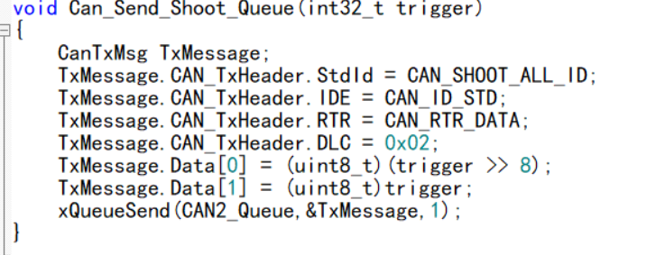

3. 注意一条CAN总线不要放太多电机，就如一条路一次性容不下太多车，车一多容易发生拥塞，总线上挂载电机数量较多，数据就容易出错。建议一条CAN总线挂载电机数量<=7个，CAN1满了就使用CAN2。    
4. 分清接收报文标识符和发送报文标识符。  

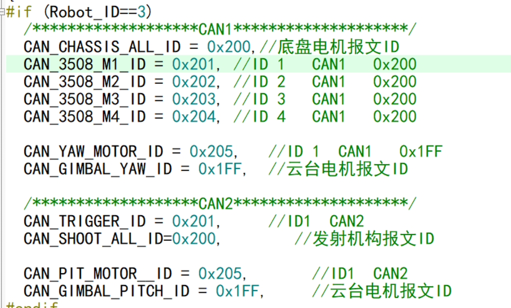

### 超级电容
超级电容是在组委会对战斗单位机器人限制了底盘功率后，为保证机器人仍然能够以较快速度移动加装的储能装置。接线如下。     

在supercap_task任务中有关于超级电容控制底盘功率即速度的代码，逻辑并不复杂。简单来说，可理解为一个水池，有一个充水口在一直充水，也有三个放水口A,B,C口径为小中大。选其一放水。只开A时水池在快速充水，只开B时水池在缓慢充水，只开C时在放水。三个不同的速度档对应了三个放水口，速度最快档的超级电容给底盘供电大于电池充电电到超级电容，速度中等的供电稍微小于充电，速度最低档供电小于充电，具体自行代码中了解。    

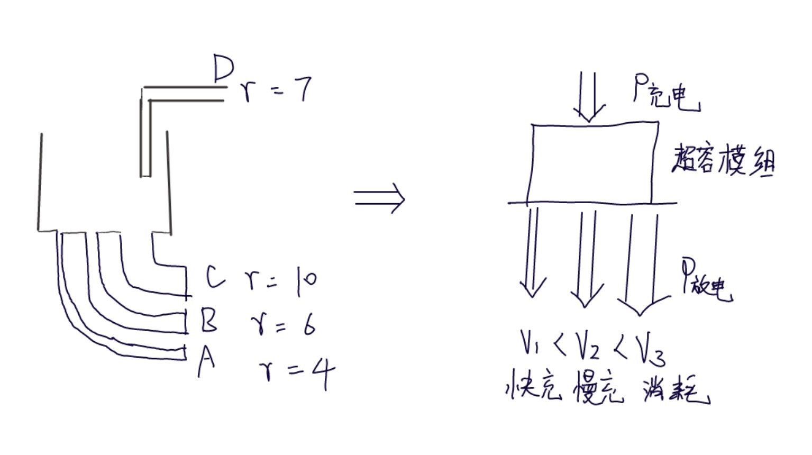

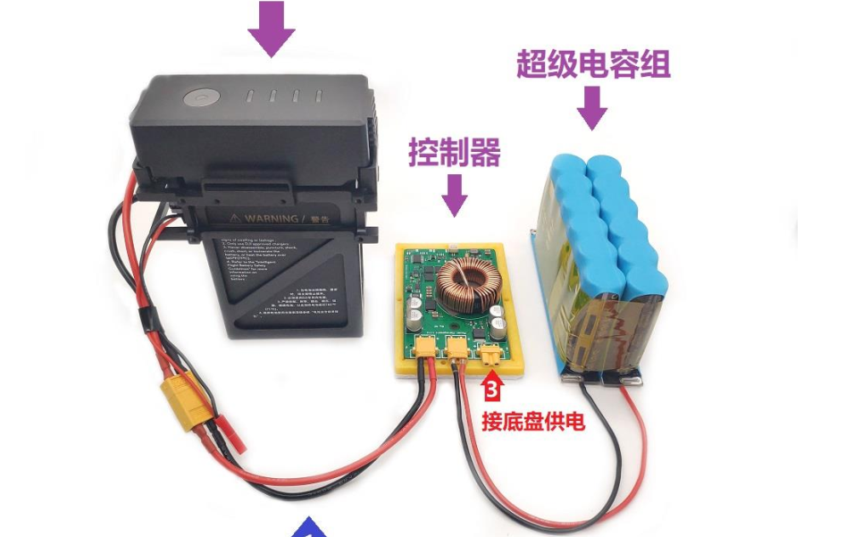

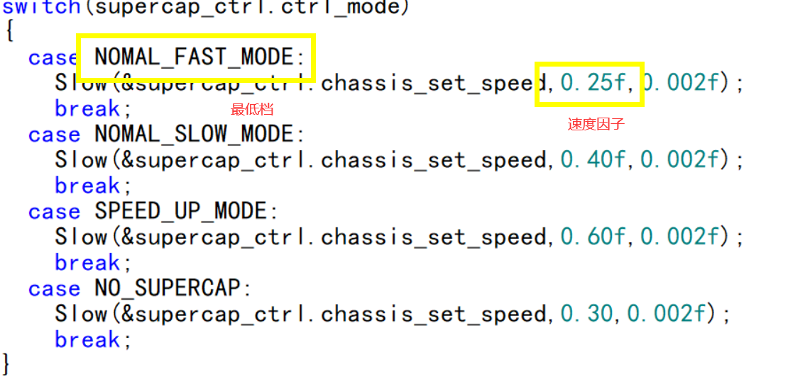

### 部分其它代码
#### 数据更新函数

底盘任务的数据更新函数即更新四个3508电机的一些参数，如下可知共四组，分别是电机速度，电机加速度，机器人速度，和云台的相对角度。电机速度是单个电机转速；电机加速度是速度的微分，简而言之就是速度的微分，即Dbuf[0]    

vx、vy、wz分别是机器人横向速度、纵向速度、旋转速度。如图1，不管是麦克纳姆轮还是全向轮，其受力分析都是45度，即一半是横向一半是纵向。有一定物理基础可根据图示画出受力分析，根据受力分析算出各个电机的速度矢量和得出整个机器人速度矢量，也就知道vx,vy,wz的计算公式从何而来；relative_angle是底盘和云台相对角度，如图2。  

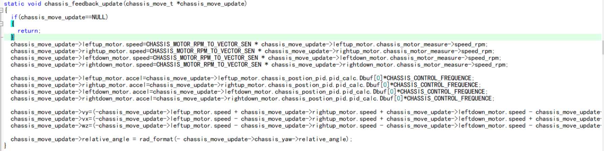

#### 速度解算函数

速度解算是上面数据更新函数的速度逆运算，好比领导下达一个任务给员工分工做。我们给机器人设定一个速度，但那是机器人整体的速度，这个速度通过解算再给四个电机，使得每个电机都有各自的职责：往哪边转，转速是多少。速度解算也可根据图一，总之画图一目了然。  

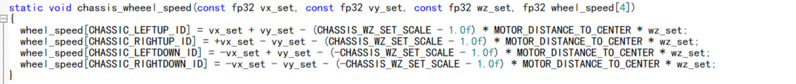
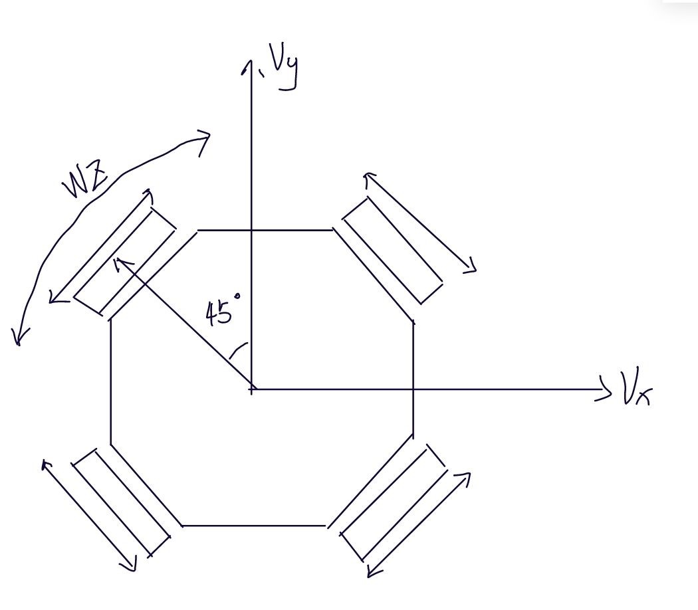   
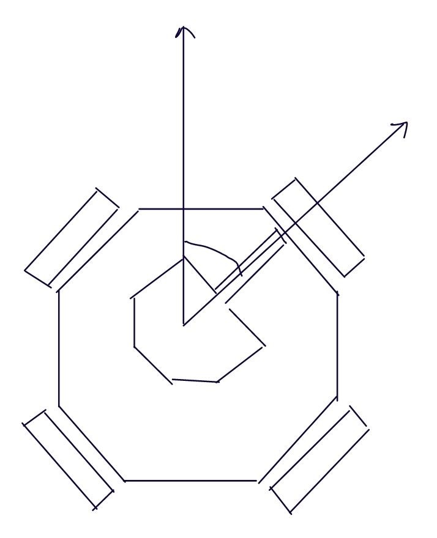

#### 小陀螺模式
该模式为底盘以某个函数规律转动（v=f(x)），而云台以绝对角度控制。这里的关键技术点为：  
如何保证底盘转动：底盘的wz遵循一定规律。本源码采用如下公式   
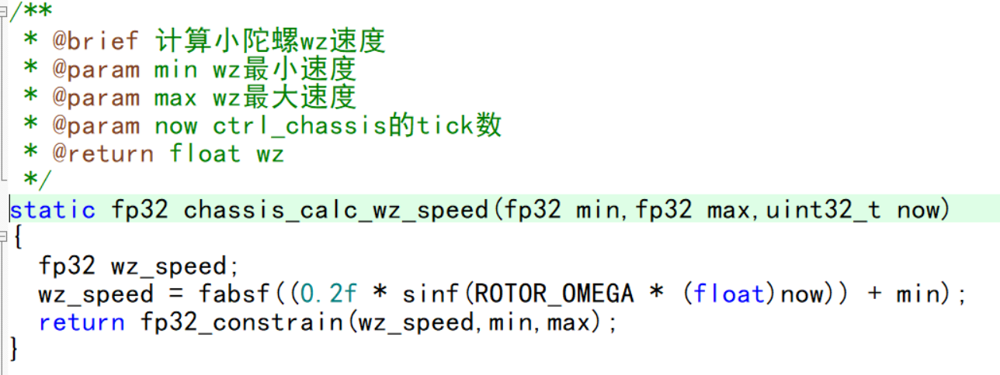

如何保证云台不跟着底盘动而只受遥控器或鼠标控制：云台电机受绝对角度控制，具体在于gimbal任务。  
如何保证在底盘转动情况下，遥控方向取决于云台方向：坐标系变换  

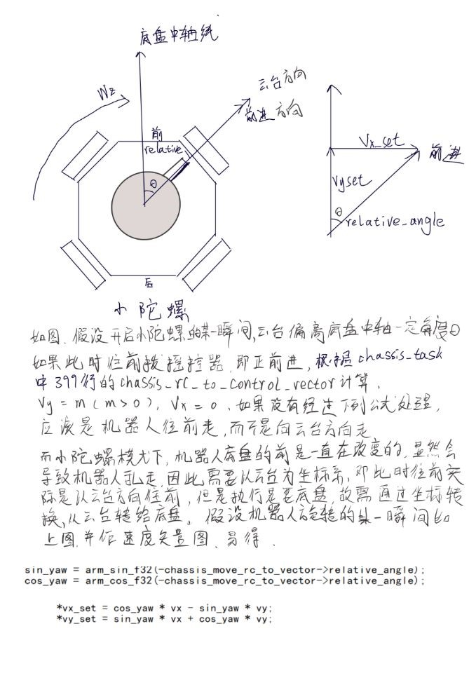

如何保证启动时不会超功率：加入斜坡函数（因为wz有初值，速度直接从0到一个速度会瞬间启动导致功率猛增，因此为防止很多类似地方都加入斜坡）。分段斜坡是因为从0开始加可稍慢，后面有一定速度后可以加快上坡。  

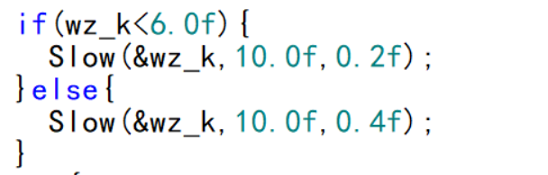

## 云台任务

云台是机器人的头部，其中的控制逻辑同样比较复杂，其中涉及到了多种模式，以下会详细介绍。总的来说，众多模式其实是对绝对角和相对角的不同应用，如果比较清楚的理解了绝对角度和相对角度的定义，很快就能理解代码。  

### gimbal_init——初始化函数
任何一个任务都必须要有初始化函数，用于对该任务的属性进行初始化，防止有隐藏bug，即你定义了什么东西，除非有确定把握，否则都要赋初值
而且赋初值不能随便给个值，尤其是本节的gimbal任务。    
Init函数中主要有以下：指针赋值，有电机、遥控器、陀螺仪等，在初始化中指针指向了这些地址后，每次中断接收数据后该内存的值发生变化，在update函数中进行数据更新；   

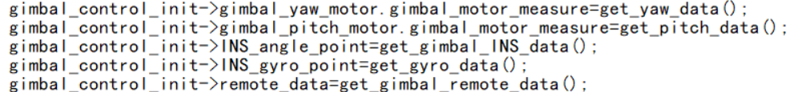

模式初始化，模式根据遥控器会立即更新，在init中无所谓加不加。  

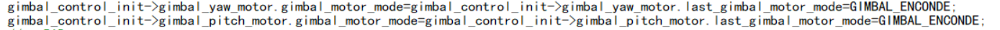

数据初始化，云台有两个电机（yaw、pitch）的设定角度，设定角速度，机械零点，俯仰限位角，还分为绝对角度和相对角度两种。机械零点是云台初始时的位置，因为云台的角度是固定的，如某个地方是180度，那么该位置就一直是180度，我们可以设定一个角度，当电机一上电就能转到该处，该角度就是机械零点。根据这个，当机械组成员将云台装好后，电控再去设置机械零点，保证上电后头是向着正前方。角度这些数据顺着代码走一遍就知道为什么赋的这个值。俯仰限位作用是限制pitch轴电机转动角度，这个区间在不会顶到其它地方的前提下，越大越好。  

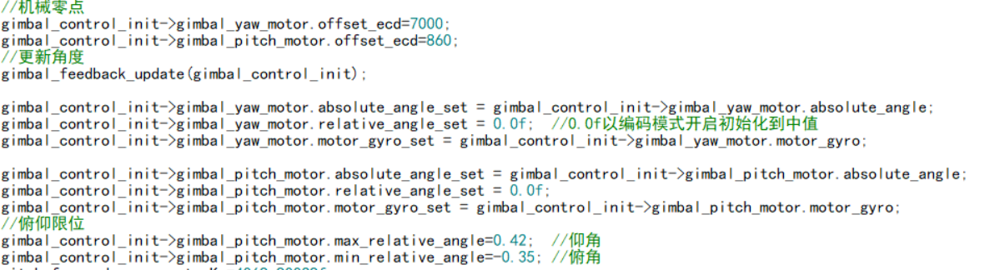
### gimbal_feedback_update——云台数据更新函数

云台需要更新的数据无非是角度这些东西。相对角由电机内部会计算，再经过单位换算即可得出。

绝对角就需要控制板上的陀螺仪。绝对角度由于是根据陀螺仪测算的，那陀螺仪的位置就不能随便放置，也就是主控板的放置有考究。主控板必须放置于能随yaw轴和pitch轴动的位置，就像你的眼睛会随着你转脖子而转动，会随着你抬头低头而改变位置，你的眼睛就大致知道你转了多少，转了有多快，如果你的眼睛在你脖子上你只知道水平转了多少，这里就需要与机械组对接好安装位置。另外，我们知道绝对角有坐标系x,y,z，这个就涉及到主控板的摆放，横着还是竖着就会影响x,y轴，这也无需记住，当机械组确定好位置后可以debug看角度的变化可知道pitch轴对应的是x还是y轴，只要保证主控板没有放歪即可。  

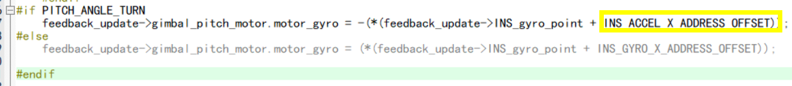

### gimbal_set_control——角度设定函数
该函数的功能是根据对应模式，计算出在该时间节点给电机设定的角度。该函数是对4种模式进行考虑，下面我们细看每个模式。   
初始模式——初始模式是无法进行控制的，初始模式时云台保持头向正前方，现已废弃使用。  

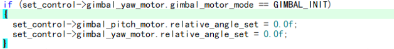
云台跟随底盘——该模式是相对角度控制，至于为什么说是云台跟随底盘，yaw轴电机定子端承接到底盘，控制底盘转动yaw轴自然跟着底盘转动，转子端承接云台，因此控制云台转到底盘是不会转动的。再看代码，将遥控器/鼠标的拨动的量转为add_yaw/pitch_angle，再进行角度限制：pitch轴到最大俯仰角时不能继续增加，yaw轴控制边界跳变时角度的变化，建议画图理解。

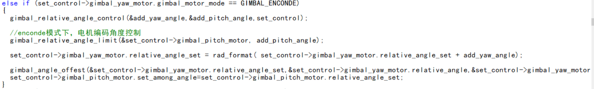

底盘跟随云台——该模式下云台由绝对角度控制，这就保证了云台坐标系是固定的，云台不会因为底盘转动、地面坡度变化等外界影响而变化。至于底盘为什么会跟随云台，假设一开始云台中轴线和底盘中轴线一致，云台转动时就会和底盘中轴线有角度差，那只需设定目标角度差为0，通过pid算法让底盘趋于和云台中轴线重合，在chassis_follow_gimbal中由 chassis_follow_gimbal函数实现。  

自瞄模式——该模式是由绝对角度控制，不过是视觉代替遥控器/鼠标将转动量给电机，和底盘跟随云台模式类似。

## 发射机构任务

发射机构任务负责射击子弹，分为摩擦轮部分和拨盘部分。摩擦轮部分，全向轮采用的是fric电机，通过pwm控制，需要注意的是电池耗电造成电压变化，会导致摩擦轮转速发生变化，在射速优先（30m/s）时对弹道影响较小，但是在其它模式时该影响会较明显，同样的距离电池没电时要抬的更高，就会导致UI在没电时准心偏移，本赛季是采用升压稳压模块维持在25v解决电压变化问题，当然如果是3508作转子就没有这样的问题。  

发射机构主要问题是拨盘部分，拨盘用的是2006电机，在此我介绍一下我写的思路。玩过游戏的都知道步枪可以点射和连射，步兵同理，对应的是单发模式和连发模式。  

单发模式是通过角度控制，即每点一下鼠标/拨一次开关设定角度就会转动45°。  

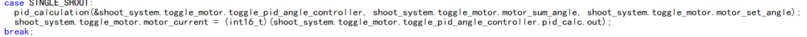
为防止卡弹，除了机械方面在优化，电控在软件上也需要写卡弹保护程序。首先是，如何判定卡弹？我采取的是当单发一次结束后，如果角度差（设定角度和实际角度）比较大，认定为初步卡弹，再计时一段时间，如果角度差还是比较大，判定为卡弹。详细代码看Single_Block_Check函数。卡弹之后如何解决？卡弹后往回转动45°，再往前转动45°，经过这样转动后只要没卡死基本都能解决卡弹。  

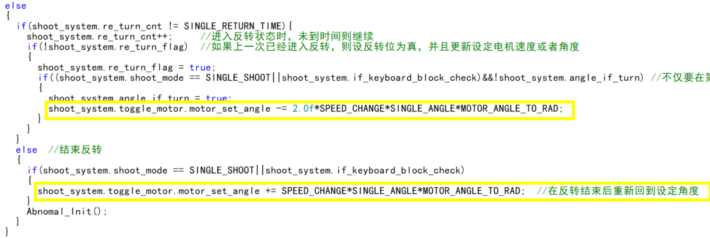
连发模式采用速度环，使得连发模式拨盘连续拨动，这个相对于单发简单得多。主要讲一下它的卡弹处理，连发卡弹的判定机制是根据2006电机的速度进行判定，当速度降低到一定程度时，就会认为是初步卡弹，当一段时间仍然是低速，就认定是卡弹从而反转，这里的低速不一定就要设为0m/s。当判定是卡弹，速度方向就反过来，计数一段时间后再恢复原来方向。  

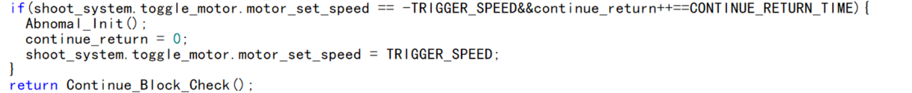
发射机构任务需要注意的主要就是卡弹部分还有鼠标点击，我在这两个地方产生的bug比较多。卡弹处理需理清什么时候算卡弹，不仅要考虑一直卡弹的情况，还要考虑卡了一下又不卡的情况；卡弹如何解决，；卡弹处理后如何善后，把那些判断卡弹的标志位计数位恢复等。鼠标点击分为短按和长按，二者区分是按压时间，需要注意从短按变为长按时的衔接。  

## 裁判系统
裁判系统可以提供很多机器人的参数，如用得多的底盘功率、弹速和枪管热量等。还有更多的信息数据可以拿来使用或设计新的功能，具体的介绍请详看裁判系统串口协议，这里简单说下其中一些目前的使用。 

底盘功率是机器人底盘的功率，也就是四个电机的功率。由于官方对底盘功率的限制，电控需要合理控制底盘功率，即控制电机的速度，在安装裁判系统后，可以通过客户端界面查看实时底盘功率。对其使用就是：检测某些运动是否超功率，例如开启小陀螺的瞬间功率会瞬时增大，就需要调节斜坡保证不超功率的同时快速进入小陀螺；查看机器人在某个档位时的底盘功率，不同等级下功率限制不同，可通过调节速度让目前等级时底盘功率略小于底盘功率，比如功率限制是60w，设置v使得功率为55w左右；  

弹速用于查看机器人是否超射速，由于摩擦轮安装位置和电机本身等各因素影响，需要手动调电机转速达到一个接近最高射速的位置，fric电机实际上就是调pwm，建议低于最大射速至少1.5m/s，不要卡极限，实际上速度会有波动，一旦超过就会超射速大幅扣血；  

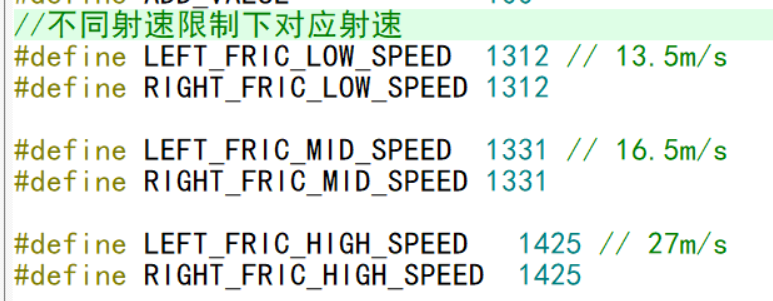

为了防止机器人持续射击，官方设置了枪管热量限制，也就是打一梭子操作手就需停止射击，电控方面可以根据当前枪管热量决定是否继续发射子弹，使得操作手无需时刻注意当前热量。

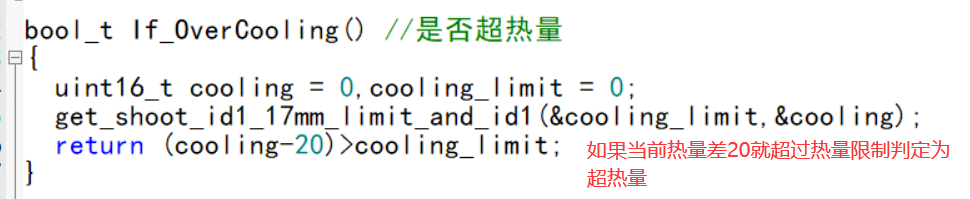
### UI绘制
在RM赛场，操作手操作电脑控制机器人，这里除了基本的机器人视野，还要设置一些UI为操作手提供瞄准等辅助功能。以下是英雄机器人的UI，与全向轮大体一致。与英雄一样全向轮左边有超级电容开启标志位，摩擦轮开启标志位还有弹仓盖开启标志位；中间是瞄准线，这个可根据机器人实际而定，保证在一定距离内依靠准线可以击中，由于采用射速优先，高射速情况下6m左右之内全向轮依靠一个准心即可；正下方是超级电容能量条和云台的绝对角度，超级电容能量条是为了更清楚的判断当前超级电容能量储备情况绘制的，如果能量条较低说明超级电容当前储能低，储能低则电压较低，会造成电机异常转动，整体就是机器人不受控制自己乱动，因此操作手需要注意能量条，能量低则缓慢或者停止运动让超级电容充能。  

有过OLED基础的同学应该更容易上手，已经写好底层函数，仅需要学习如何调用即可。其中静态UI的绘制无需多说，直接调用绘制字符串函数和绘制图形函数。动态UI即数据或图形实时更新的UI，一是有些数据需要在变化如超级电容电压和云台角度等，二是某些图形化UI可直观的看出机器人状态。  

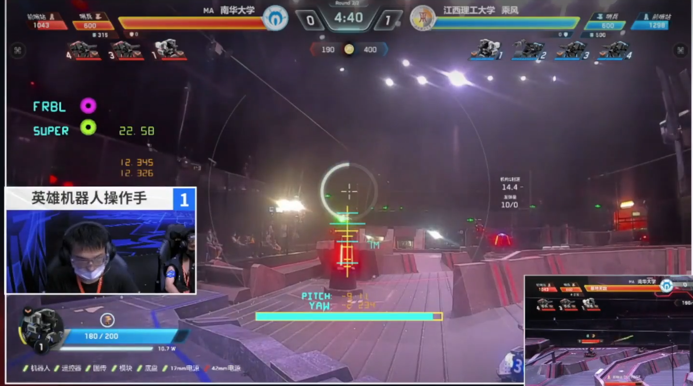

## 其它

### 接口函数
所谓接口函数指的是文件之间进行联系的函数，接口函数通常由其它文件进行调用。当然，这不是严格的命名，但是在实际应用上该类函数就是相当于一个接口。最普遍的就是get和set接口，他们执行的功能分别是获取数据/状态,修改数据/状态，这种命名和使用的好处是可维护性高，简洁美观，大大减小了耦合度。

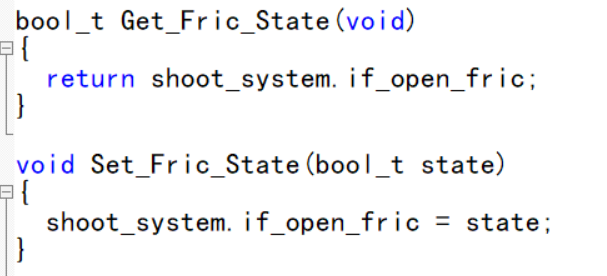

### 关于理线
除了软件上需要写代码外，硬件上还需要设计/焊接电路板、理线等。理线表面上看是将数据线和电源线接好能让机器人动即可，看上去很简单，实际上我认为理线是需要一定精力学习的。能够出现在RM赛场上的机器人，理的线一定是隐藏性好、美观、最重要的是接线稳固，这就是赛场上机器人稳定性的最大保证之一。
隐藏性好一方面是可以减少子弹击中的概率，否则一发子弹很容易将数据线直接扯断，一方面是尽可能少的接线裸露也更美观；美观指的是在布线时注意线的位置和线序，只考虑两头是否接上线而不考虑线途经的过程容易导致线与线之间交错混乱，或位置不合理，在调车过程中就有can线放置不当导致电机转子磨损线的例子，建议合理使用理线器、扎带及热缩管等；稳固性指能够隐藏的线尽量隐藏，不能够隐藏的线一定要做好保护措施，如使用珍珠棉、理线器等，在22赛季超队对战太原工业大学的第二局中，由于忽视了对装甲模块的线进行保护，导致被子弹击中将线扯下，该局全向轮步兵直接裁判系统扣血死亡，因此接线稳固是理线中最重要的一环。

