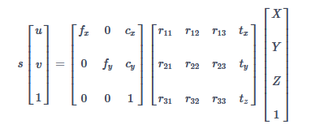
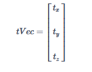
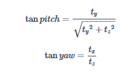
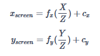
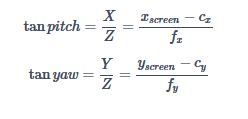

## 前言

这篇博客内容主要是22年乘风战队哨兵视觉源码介绍，以及本人在该赛季调试哨兵视觉的一些经验。首先感谢2020年吉林大学和2018年苏州大学开源代码对本套代码完成提供的巨大帮助。本赛季的哨兵视觉代码主要有**相机驱动**、**装甲板识别**、**角度解算**以及**串口通信**这四个模块。阅读文档时，可与[SENTRY_NANO](https://jxlgdx.coding.net/p/shijue/d/SENTRY_NANO/git)配套食用。


## 依赖环境

### 硬件设备

上云台：

| 硬件     | 型号                  | 参数           |
| -------- | --------------------- | -------------- |
| 运算平台 | JETSON NANO           | B01            |
| 相机     | USB免驱工业模组摄像头 | 1080P_PCBA模组 |
| 镜头     | USB免驱工业摄像头镜头 | 焦距：8mm      |

下云台：
| 硬件     | 型号                      | 参数           |
| -------- | ------------------------- | -------------- |
| 运算平台 | JETSON NANO国产开发板套件 | B01            |
| 相机     | USB免驱工业模组摄像头     | 1080P_PCBA模组 |
| 镜头     | USB免驱工业摄像头镜头     | 焦距：6mm      |


### 软件设备

| 软件类型 | 型号           |
| -------- | -------------- |
| OS       | Ubuntu 18.04   |
| IDE      | Qt Creator-5.3 |
| Library  | Opencv-3.4.0   |


## 整体框架

```
SENTRY-NANO/
├── AngleSolver
│   └── AngleSolver.h（角度解算模块头文件）
│   ├── AngleSolver.cpp（角度解算模块源文件）
├── Armor
│   ├── Armor.h（装甲板识别模块头文件）
│   ├── Armor.cpp（装甲板类源文件）
│   ├── DigitalClassifier.cpp（装甲板数字识别类源文件）
│   ├── Lights.cpp（灯条监测相关函数源文件）
│   ├── Detector.cpp（装甲板识别子类源文件）
├── Common
│   ├── 12345svm.xml（SVM模型文件）
│   ├── 5.xml（相机参数文件）
│   └── Common.h（公有内容声明头文件）
├── Camera
│   ├── HIKcamera
│   │	├── HIKcamera.h  （海康相机类头文件）
│   │	└── HIKcamera.cpp（海康相机类封装源文件）
│   └── USBcamera（相机SDK包含文件）
│       ├── USBcamera.h  （USB相机类头文件）
│       └── USBcamera.cpp（USB相机类封装源文件）
└── MyAlgorithm
│   ├──  MyAlgorithm.h  （PID头文件）
│   └──  MyAlgorithm.cpp（PID源文件）
└── Serial
│   ├──  Serial.h（串口头文件）
│   └──  Serial.cpp（串口源文件）
├── Main
|	├── init.cpp（串口初始化源文件）
│   ├── ArmorDetecting.cpp（装甲板识别线程）
│   ├── ImageUpdating.cpp（图像更新线程）
│   └── main.cpp（main函数，程序主入口源文件）
├── Thread
│   ├── Threading.h（多线程头文件）
│   ├── Dealing.cpp（图像处理线程）
│   ├── USBcamera_Updating.cpp（图像更新线程-USB相机）
│   ├── HIKcamera_Updating.cpp（图像更新线程-海康相机）
│   └── SerialThread.cpp（接受数据处理源文件）

```

## 装甲板识别

使用基于检测目标特征的OpenCV传统方法，实现思路为找出每一帧图像中所有目标颜色灯条，并一一拟合，筛选出目标装甲板。

主要步骤：**图像预处理**、**灯条检测**、**装甲板匹配**、**装甲板数字识别**及最终的**目标装甲板选择**。

1. **图像预处理**

​		为找到目标灯条，需要对捕捉到的图片进行颜色提取。颜色提取基本方法有BGR、HSV、通道相减法。  
​		前两种方法由于需要遍历所有像素点，会产生较长的耗时，对于NANO运行程序来说是一个极大的	负担因		此我们选择了**通道相减法**进行颜色提取。  
​		其原理是在**低曝光**情况下，蓝色灯条区域的B通道值会远高于R通道值，将图片的B通道减去R通道	再二进行		值化，即可提取出蓝色灯条区域，反之亦然。  
​		此外，我们还对颜色提取二值图进行一次掩膜大小3*3，形状MORPH_ELLIPSE的膨胀操作，用于	图像降噪		及灯条区域的闭合。 

```c++
/**
* @brief: load source image and set roi if roiMode is open and found target in last frame 载入源图像并设置ROI区域（当ROI模式开启，且上一帧找到目标装甲板时）
* @param: const Mat& src     源图像的引用
*/
void Detector::setImg(Mat & src){
    src.copyTo(srcImg);  //deep copy src to srcImg 深（值）拷贝给srcImg
    classifier.loadImg(srcImg); //srcImg for classifier, warp perspective  载入classifier类成员的srcImg，用于透射变换剪切出装甲板图
    srcImg_binary = Mat::zeros(srcImg.size(), CV_8UC1); //color feature image

    //pointer visits all the data of srcImg, the same to bgr channel split 通道相减法的自定义形式，利用指针访问，免去了split、substract和thresh操作，加速了1.7倍
    //data of Mat  bgr bgr bgr bgr
    uchar *pdata = (uchar*)srcImg.data;
    uchar *qdata = (uchar*)srcImg_binary.data;
    int srcData = srcImg.rows * srcImg.cols;
    if (enemyColor == RED)
    {
        for (int i = 0; i < srcData; i++)
        {
            if (*(pdata + 2) - *pdata > armorParam.color_threshold)
                *qdata = 255;
            pdata += 3;
            qdata++;
        }
    }
    else if (enemyColor == BLUE)
    {
        for (int i = 0; i < srcData; i++)
        {
            if (*pdata - *(pdata+2) > armorParam.color_threshold)
                *qdata = 255;
            pdata += 3;
            qdata++;
        }
    }

    Mat kernel = getStructuringElement(MORPH_ELLIPSE, Size(3, 3)); //kernel for dilate;  shape:ellipse size:Size(3,3) 膨胀操作使用的掩膜

    dilate(srcImg_binary, srcImg_binary, kernel); //dilate the roiImg_binary which can make the lightBar area more smooth 对roiIng_binary进行膨胀操作，试得灯条区域更加平滑有衔接
}
```


2. **灯条检测**  
   灯条检测的主要思路是，先对预处理后的二值图进行轮廓的查找（findContours），  
   接着对所有轮廓筛选面积，过滤小发光点，   
   后的轮廓进行拟合椭圆（fitEllipse），  
   使用得到的旋转矩形（RotatedRect）构造灯条实例（LightBar），  
   在筛除偏移角过大的灯条后依据灯条中心从左往右排序。  
3. **装甲板匹配**  
   分析装甲板特征可知，装甲板由两个长度相等互相平行的侧面灯条构成，  
   因此我们对检测到的灯条进行两两匹配，  
   通过判断两个灯条之间的位置信息：角度差大小、错位角大小、灯条长度差比率和X,Y方向投影差比率，  
   从而分辨该装甲板是否为合适的装甲板（isSuitableArmor），  
   然后将所有判断为合适的装甲板放入预选装甲板数组向量中。  
   同时，为了消除“游离灯条”导致的误装甲板，编写了eraseErrorRepeatArmor函数，专门用于检测并删除错误装甲板。
```c++
// judge whether this armor is suitable or not  判断本装甲板是否是合适的装甲板
bool Armor::isSuitableArmor() const
{
    return
        this->getAngleDiff()	  < armorParam.max_angle_diff	    &&		// angle difference judge the angleDiff should be less than max_angle_diff 灯条角度差判断，需小于允许的最大角差
        this->getDeviationAngle() < armorParam.max_deviation_angle  &&		// deviation angle judge: the horizon angle of the line of centers of lights 灯条错位度角(两灯条中心连线与水平线夹角)判断
        this->getDislocationX()	  < armorParam.max_x_diff_ratio     &&		// dislocation judge: the x and y can not be too far 灯条位置差距 两灯条中心x、y方向差距不可偏大（用比值作为衡量依据）
        this->getDislocationY()	  < armorParam.max_y_diff_ratio     &&		// dislocation judge: the x and y can not be too far 灯条位置差距 两灯条中心x、y方向差距不可偏大（用比值作为衡量依据）
        this->getLengthRation()   < armorParam.max_lengthDiff_ratio;
}
```

   

```c++
/**
 *@brief: detect and delete error armor which is caused by the single lightBar 针对游离灯条导致的错误装甲板进行检测和删除
 */
void eraseErrorRepeatArmor(vector<ArmorBox> & armors)
{
	int length = armors.size();
	vector<ArmorBox>::iterator it = armors.begin();
	for (size_t i = 0; i < length; i++)
		for (size_t j = i + 1; j < length; j++)
		{
			if (armors[i].l_index == armors[j].l_index ||
				armors[i].l_index == armors[j].r_index ||
				armors[i].r_index == armors[j].l_index ||
				armors[i].r_index == armors[j].r_index)
			{
				armors[i].getDeviationAngle() > armors[j].getDeviationAngle() ? armors.erase(it + i) : armors.erase(it + j);
			}
		}
}
```

*判断两灯条是否为装甲板时，具体参考的数据值，可通过键盘依具体情况做出调整。*


4. **装甲板数字识别**
    将装甲板匹配完成后，利用装甲板的顶点在原图的二值图（原图的灰度二值图）中，将装甲板图出来，
    再使用透射变换，将二值图中的数字“拉正”，随后装甲板图变换为SVM模型所需的Size，随后投入SVM中，识别出装甲板数字。

```C++
class DigitalClassifier
{
public:
    DigitalClassifier();
    ~DigitalClassifier();

    /**
     * @brief: load the SVM model used to recognize armorNum 载入SVM模型（用于识别装甲板数字）
     * @param: the path of xml_file, the size of the training dataset ImgSize  待载入SVM模型的路径 模型的图片尺寸
     */
    void loadSvmModel(const char *model_path, Size armorImgSize = Size(40, 40));

    /**
     * @brief: load the current roiImage from ArmorDetector 载入roiImage（剪切出装甲板）
     * @param: the path of xml_file  待载入SVM模型的路径
     */
    void loadImg(Mat & srcImg);

    /**
     * @brief: use warpPerspective to get armorImg  利用透视变换获得装甲板图片
     * @param: the path of xml_file  待载入SVM模型的路径
     */
    void getArmorImg(Armor& armor);

    /**
     * @brief: use SVM to recognize the number of each Armor 利用SVM实现装甲板数字识别
     */
    void setArmorNum(Armor& armor);

private:
    Ptr<SVM>svm;  //svm model svm模型
    Mat p;		//preRecoginze matrix for svm 载入到SVM中识别的矩阵
    Size armorImgSize; //svm model training dataset size SVM模型的识别图片大小（训练集的图片大小）

    Mat warpPerspective_src; //warpPerspective srcImage  透射变换的原图
    Mat warpPerspective_dst; //warpPerspective dstImage   透射变换生成的目标图
    Mat warpPerspective_mat; //warpPerspective transform matrix 透射变换的变换矩阵
    Point2f srcPoints[4];   //warpPerspective srcPoints		透射变换的原图上的目标点 tl->tr->br->bl  左上 右上 右下 左下
    Point2f dstPoints[4];	//warpPerspective dstPoints     透射变换的目标图中的点   tl->tr->br->bl  左上 右上 右下 左下
};
```

*遗憾的是，这部分算法虽然从理论上来看似乎具有可行性，但由于相机设备的局限性，无法在赛场上较好地完成任务，需硬件设备或是算法的优化。*

5. **目标装甲板选取**
    针对之前获取的各项装甲板信息（顶点中心点坐标与枪口锚点距离、面积大小、装甲板数字）进行加权求和，从而获取最佳打击装甲板作为最终的目标装甲板。
    
    *经过对比赛视频和比赛时累积素材的分析，未曾出现哨兵正常运行视觉程序时多个机器人同时入镜，因此该部分代码有效性有待考察。*
    
    
## 角度解算

角度解算的主要目的是计算出目标装甲板中心与枪口的相对YAW角度和PITCH角度。

- 由于下云台本身垂直高度较低，且最高仰角受机械物理限制和电控限位，射程较小，因此基本无需考虑重力影响；而上云台则需在目标PITCH角度的基础上，基于重力因素，做出相应变换。

```c++
void AngleSolver::compensateGravity()  // pitch加上重力补偿
    float compensateGravity_pitch_tan = atan((sin(x_pitch) / 0.5 *9.8*distance / pow(BULLET_SPEED,2)) / cos(x_pitch));
    x_pitch = tan(compensateGravity_pitch_tan);
}

```

- 此部分针对目标距离使用了两种解算模型，即**P4P解算**和**PinHole解算**。

​     我们知道，相机成像原理公式如下：

  

   1. P4P解算原理  
      由上述相机成像原理可得相机-物点的平移矩阵为：
      
      

   	转角计算公式如下：

 

   2. 小孔成像原理  
      像素点与物理世界坐标系的关系：  

      

      则转角计算公式如下： 

      

      经测试，在5米内，P4P模型准确率较高；反之，更建议使用小孔成像模型。
      
      *在测试相机内参时，发现由代码计算出出的数值与由MATLAB得出的数值总是存在差距，经测试，使用前者得出的PITCH值较为准确；使用后者计算出的YAW值和实际相差更小。因此，本套代码使用两套内参分别进行计算。*

## 通信协议

通信主要分为与STM32通信以及上下云台间的通信。

- 与STM32通信的协议内容主要参考 [视觉-电控协议](视觉-电控协议.xlsx)，其中差错检测使用CRC8和CRC16，具体通过查表法实现。
- 上下云台间的通信由于时间问题，本赛季暂未加上这部分模块，若下一赛季仍为上下双云台结构，可酌情编写相关算法。此处提供一个思路：在比赛中，较机器人近的敌方机器人（除工程外）的攻击优先级总是高于远处（即敌人已经到前面就要击打哨兵了，上云台肯定得先解决眼下的再处理远一点的），这也是上下云台通信存在的意义，因此建议在上下云台间加入一个单方面的通信，即相互之间下云台只提供发送数据，上云台只进行接收数据。当下云台检测到目标来袭，将得到的敌方位置数据进行处理，发送给上云台，上云台接收后立马”低头“寻找目标，若目标超出限位，则恢复巡航；反之则在识别到目标后开始击打。
- 本赛季针对通信准备了两种硬件方案：USB和UART。使用USB通信时，USB接口容易受机器人运动影响，即使上了热熔胶仍存在松动风险，建议使用**UART串口**进行数据的收发。


## 代码调试

- 本代码自定义了一套调试用的函数，集中控制灯条、装甲板识别、角度解算等信息进行可视化输出。即按顺序改变函数的参数，即可实现相应窗口的开关。

  ```C++
  //装甲板检测识别调试参数是否输出
          //param:
          //		1.showSrcImg_ON,		  是否展示原图
          //		2.bool showSrcBinary_ON,  是否展示二值图
          //		3.bool showLights_ON,	  是否展示灯条图
          //		4.bool showArmors_ON,	  是否展示装甲板图
          //		5.bool textLights_ON,	  是否输出灯条信息
          //		6.bool textArmors_ON,	  是否输出装甲板信息
          //		7.bool textScores_ON	  是否输出打击度信息
          //					   1  2  3  4  5  6  7
          detector.showDebugInfo(0, 1, 1, 1, 0, 0, 0);
  ```

    

  ```C++
  //角度解算调试参数是否输出
           //param:
           //		1.showCurrentResult,	  是否展示当前解算结果
           //		2.bool showTVec,          是否展示目标坐标
           //		3.bool showP4P,           是否展示P4P算法计算结果
           //		4.bool showPinHole,       是否展示PinHole算法计算结果
           //		5.bool showCompensation,  是否输出补偿结果
           //		6.bool showCameraParams	  是否输出相机参数
           //					      1  2  3  4  5  6
           anglesolution.showDebugInfo(1, 0, 0, 0, 0, 0);
  ```


- 并可通过键盘控制部分识别参数，如：颜色、击打点像素值、预处理阈值、数字识别阈值等自己需要调节的参数，为代码的调试和优化带来便利。

  ```c++
          switch (chKey) {
          case 'b':
          case 'B':
              ENEMYCOLOR = BLUE;
              break;
          case 'r':
          case 'R':
              ENEMYCOLOR = RED;
              break;
          case 'a':
          case 'A':
              xdata += 1;
              break;
          case 'd':
          case 'D':
              xdata -= 1;
              break;
          case 'w':
          case 'W':
              ydata += 1;
              break;
          case 's':
          case 'S':
              ydata -= 1;
              break;
          case 'z':
          case 'Z':
              armorParam.svm_threshold -= 1;
              break;
          case 'x':
          case 'X':
              armorParam.svm_threshold += 1;
              break;
          case 'c':
          case 'C':
              armorParam.color_threshold -= 1;
              break;
          case 'v':
          case 'V':
              armorParam.color_threshold += 1;
              break;
          case 'f':
          case 'F':
              armorParam.max_deviation_angle -= 1;
              break;
          case 'g':
          case 'G':
              armorParam.max_deviation_angle += 1;
              break;
          case 'q':
          case 'Q':
          case 27:
              bRun = false;
              break;
          default:
              break;
          }
  ```

  

