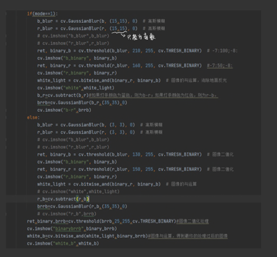
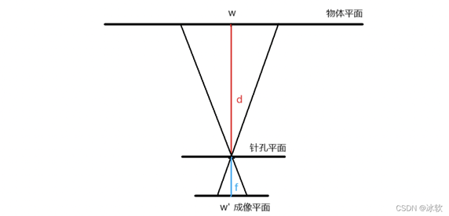
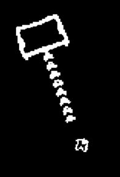
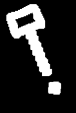
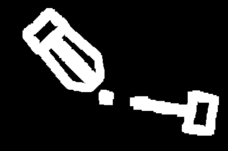

## 前言
自瞄部分是我从作为战队新成员到参加比赛的过程之中的总结与思考，内容主要讲代码思路以及在视觉调试过程中需要注意的地方，一些不重要的地方可以结合具体代码进行思考，希望对新成员能够有所帮助。能量机关部分则会介绍代码具体的功能，是如何去实现，也会补充一些自己踩过坑后知道的经验.这是代码：[步兵视觉](https://jxlgdx.coding.net/p/shijue/d/infantry_/git)
## 自瞄部分
### 代码阅读
步兵视觉的自瞄代码部分主要分为三大部分：视觉图像处理，测距以及串口通讯和PID控制。
#### 图像处理以及确定装甲板区域
一、我们的首要工作就是将图像的RGB（红绿蓝）三通道分离，三通道中，由于灯条只有红蓝双色，故主要使用红蓝通道。提取出红蓝通道后，对其进行高斯模糊以及二值化操作之后，对处理之后的红蓝通道进行相与操作，得出图像white_light，这一步是为了消除地面反光对灯条识别所造成的影响。除此步操作之外，还需进行红蓝通道相减，得出图像b-r/r-b（需注意：<u>灯条颜色为蓝色，为b-r；灯条颜色为红色，为r-b</u>），然后将b-r/r-b进行高斯模糊，消除噪点，得到图像brrb。最后将图像brrb和图像white_light进行相与操作，得到只含有类似灯条的图像whit_b。
（除去以上操作，中间还夹杂着图像二值化以及高斯模糊操作，数值需要根据曝光以及场地的变化去进行调整，需要进行不断地尝试才可以找到最合适的值）

   

二、寻找与筛选灯条轮廓  
这一部分主要使用cv2.findContours寻找white_b图像中所有的轮廓，其中同样包含着非灯条轮廓，我们需要通过例如灯条面积，灯条长宽比等条件来进行条件筛选， 而这个时候，我们就需要创建一个n维列表来保存筛选之后n个灯条的相关数据，保存的数据可以根据之后灯条匹配时所需要的来进行添加。
```
if (area>=5 and area<3000):
    if (K!=None):
        if(h>w and abs(K)>1):
            num.append([x,y,w,h,box,top_most,bottom_most])
            cv.drawContours(video, [box], 0, (255, 0, 255), 5)
        else:
            continue
    else:
        if(h>w):
            num.append([x,y,w,h,box,top_most,bottom_most])
            cv.drawContours(video, [box], 0, (252, 0, 255), 5)
        else:
            continue
else:
    pass
```
需要注意：通过cv2.minAreaRect()函数得到的rect包含轮廓最小矩形拟合之后的中心点以及长宽，这其中的长宽是根据最小矩形与x轴夹角得到的，并不一定是长>宽，<u>故需要进行转换使得长>宽</u>。
```
rect=cv.minAreaRect(contour)#中心点坐标以及角度
box=cv.boxPoints(rect)#角点坐标
box=np.int0(box)
(x,y)=np.int0(rect[0])#灯条中心点
w=rect[1][0]
h=rect[1][1]
```
三、灯条对的匹配  
首先确定上一个步骤所筛选出来的轮廓两两之间是否满足形成一组灯条对所需要的条件（通常使用斜率等关系，也可以使用其他你认为更好的方法去进行限制），若满足限制的条件，则可进行下一步判断。这里有又再次分为两种情况：1、画面之中类似灯条的轮廓数量仅为2，如果满足上述限制条件则可认为是一组灯条对（情况少见）2、画面之中类似灯条的轮廓数量大于2，则需要判断轮廓之间是否存在第三个轮廓。
```
if (r < 800 and r > 0):
    draw = False
    if (len(num) == 2):
        draw = True
    else:
        for m in range(len(num)):#判断两灯条之间是否有第三个灯条
            if(m!=n and m!=i):
                draw=True
                x0=num[m][0]
                y0=num[m][1]
                dx=center_x-x0
                dy=center_y-y0
                if(math.sqrt(dx*dx+dy*dy)<r):
                    draw=False
                    break
```
四、装甲板区域的确定  
在经过第四步操作过后，我们确定了灯条对，但是这些灯条对所形成的区域并不一定是装甲板所在区域，我们需要通过条件来进一步确定，考虑到装甲板都为黑底白字，我们可提取类装甲的ROI区域，对ROI区域进行二值化寻找最小矩形拟合的轮廓，寻找到一帧画面之中矩形的最长边（由于摄像头画面存在噪点，我们需要<U>对ROI区域进行高斯模糊</U>，否则大量噪点会在寻找最长边时造成巨量的计算工作，大幅度降低帧率）并找到和灯条长/宽之间的比例关系来寻找装甲板区域。同时，我们也可以利用灯条中心点间距以及高度差来寻找到装甲板区域（中心点间距通常小于灯条宽度的5倍，高度差通常小于灯条宽度的1/2）。
#### 测距
在测距方面我们其实走过许多弯路，一开始我们采用PNP测距，通过代码对黑白棋盘格进行标定，得到相聚的内参矩阵以及畸变系数，利用cv2.PNP函数进行距离的测量，但最终效果不尽人意。最主要的原因就是标定所得到的参数不准确，误差较大，在测量距离时数值跳动明显。最后我们还是选择了单目测距。  
单目测距的原理很简单——小孔成像（相似三角形），核心就是一个公式：distance=（W*F)/P[物体的真实宽度*摄像头的焦距/物体的像素宽度]。关于焦距的测量，可以先固定距离利用公式得出焦距即可，需要注意的是，在确定焦距之前，<U>做好图像处理的工作，保证灯条轮廓的稳定性</U>，因为灯条轮廓的宽度也会影响测距的准确，一旦灯条像素宽度数值变化就最好重新测量一遍焦距。

    

两种测距方法各有利弊：  
PNP测距无需考虑角度问题，但前提是你所得到的参数误差小，如果利用matlab工具箱进行标定，误差值最好<U>保持在0.1以下</U>，才有可能得到一个较好的测量结果。  
单目测距对参数要求不高，计算更为简单，但同样的，在角度变化大，灯条的像素宽度变化时也会导致测量的不准确，比较适合特定固定物体。但由于采用PNP测距误差过大，我们只能采用单目测距方案。针对灯条像素宽度变化的问题，当灯条像素宽度（w）与长度（h）满足h>w*3时，才对距离进行计算。
```
if(h>w*3):
    distance=Od.cejv(b3*1.1,sjw)#以厘米为单位
```
#### 串口通讯和PID
关于串口通讯这一方面，我们与电控对接时需要注意按照双方协议规定来进行数据的收发即可。  
在PID控制这一方面，我也只是给出一点建议：对于P值，你所传入的值越大，在跟随装甲板时，机器人头部运动的更快，但传入的值过大会导致超调，可能会出现疯转，所以建议从较小的值开始逐渐增加；对于I值，一般设为0；对于D值，可以理解为用于稳定P，当需要又快又稳时，就需要较大的P值，但可能会导致跟随时晃动，D值增大可以起到抑制作用，但同样不能过大，否则抑制过了头也会起到反作用。
### 其他
在进行参数传入时，可以考虑利用键盘对参数进行加减操作，这样在调试时能够节约程序重启所造成的时间损耗。   
在实际的调试过程中，应该多尝试不同曝光情况下的实际效果，曝光的高低同样也会影响程序运行的实际效果，如果想要达到更好的效果就必须要多进行尝试。
## 能量机关部分
#### 主函数
实现摄像头驱动的调用以及图像预处理的调用，跟英雄一样，但是由于步兵的自瞄部分与能量机关部分的识别方面不同，因此在主函数处需要判断此时需要进入哪个识别环境，这里就要靠电控传给视觉的数据中帧头的不同来辨别是自瞄还是能量机关了。
#### 图像识别
图像预处理方面由于能量机关会在两种不同的环境下出现，超级对抗赛的场地相对单项赛的场地来说要亮，因此如果使用传统视觉的话，阈值一定要同时满足这两种环境（我的看法是以超级对抗赛为主，因为超级对抗赛的场地要比单项赛复杂，如果能满足超级对抗赛，有很大可能能满足单项），还有在调阈值时一定要注意一点，就是要把扇叶上的流水灯效要模糊成一条直线，这是因为我们后续要找的就是这个锤子轮廓，不模糊成一个锤子轮廓，那你只会找到一个装甲板轮廓。    


   

之后进入轮廓筛选：先是找出所有的子轮廓，装甲板也会包含在里面
```
for component in zip(contours, hierarchy):
    currentcontour = component[0]
    currenthierarchy = component[1]
    if currenthierarchy[2] < 0: #判断轮廓是否为子轮廓
        rect = cv2.minAreaRect(currentcontour)#子轮廓的最小拟合轮廓旋转矩形
        box = np.int0(cv2.boxPoints(rect))#矩形的四个角点取整
        x, y = rect[0]  # 矩形左上角的坐标# 所有子轮廓，其中包含装甲板的中心点
        X.append(x)
        Y.append(y)
```
然后进入锤子的筛选，这里筛选与自瞄不同，自瞄可以依靠灯条，这里只能观察待击打扇叶与已击打成功扇叶的区别（要注意一点处于正在激活状态的能量机关是只会亮一片待击打扇叶，因此不能纯靠排除已击打成功扇叶来筛选），我选择的是用扇叶的面积来区分，这个方法虽然简单且有效，但是有个不好的地方，就是需要通过测试来得知扇叶的面积范围，而且可影响面积的因素有很多，比如亮度不同，阈值不同，或是更换了一个摄像头都有可能影响。  
当然还有另一种方法，就是用待击打扇叶与已击打成功扇叶的子轮廓不同来筛选，可以看到待击打扇叶只有一个子轮廓，而已击打成功扇叶却有三个，因此只要筛选出只有一个子轮廓的扇叶便可认定它是待击打扇叶，但是这个方法我曾用轮廓层级并没有实现，因为，轮廓层级中的子轮廓只是代表第一个子轮廓，并不代表个数，如果有其他代码可以实现这个方法的话，我认为这个方法会优于面积的那个方法，（也可以尝试使用轮廓中的凸包能不能区分，从中取能实现且帧率高的方法）。

   

最后判断之前得到的子轮廓的中心点有没有在锤子轮廓里，有则是我们需要的待击打扇叶的装甲板的中心点。
```
def point_contour_dist(contour, point, measure_dist=False):  #判断点是否在轮廓内的函数
    dist = cv2.pointPolygonTest(contour, point, measure_dist)
    if dist == -1:#不在，返回-1
        return -1
    elif dist == 1:#在，返回1
        return 1
    else:
        return 0
```
#### 实现预测击打
识别到待击打扇叶后，接下来最重要的就是预测部分了，因为能量机关的转速是正弦函数，速度忽快忽慢的，而且发射机构移动以及弹丸发射也会有一些延迟，所以预测必不可少。我的想法是识别圆心，然后计算出在这段延迟的时间里将移动的角度，绕着圆心旋转这个角度就得到了预测点，那么这里就有三个问题要解决：1.怎么识别圆心，2.如何知道往哪边旋转，3.如何得到角度。  
这第一个问题我是用锤子轮廓自身的中心点与装甲板的中心点连线然后往圆心方向延长一定距离得到，这个方法有效但也要靠试验得出需要延长的距离且影响因素有很多，那么还有种办法就是用面积，因为圆心处有个R标，因此圆心处的面积是整个能量机关最小的，由于我担心超级对抗赛现场环境复杂，会有很多小噪点产生影响，所以弃用了，但是听说用HSV通道可以解决。
```
# ------------------------------------划分不同区域，通过大风车中心点在装甲板中心与锤子中心的连线上得到大风车的
#                                     中心点
if (slope > 0 or slope == 0 or slope < 0):#斜率存在时
    if (n < X[i]):  #X[i]，Y[i]为装甲板的中心点
        if (m < Y[i]):
            c = n - (math.sqrt(20000 / (math.pow(slope, 2) + 1)))
            d = m - slope * (n - c)+10
            cv2.circle(frame, (int(c), int(d)), 5, (0, 255, 0), -1)
        elif (m > Y[i]):
            c = n - (math.sqrt(15000 / (math.pow(slope, 2) + 1)))
            d = m - slope * (n - c)+10
            cv2.circle(frame, (int(c), int(d)), 5, (0, 255, 0), -1)
        else:
            c = n - (math.sqrt(15000))
            d = m+10
            cv2.circle(frame, (int(c), int(d)), 5, (0, 255, 0), -1)
```
第二个问题可以用前两帧已识别到的装甲板中心做对比，就可以知道能量机关往哪边旋转。最后一个问题，是最难的一个，这个延迟时间需要自己知道打下一片扇叶的时候需要多少，这个可以通过测试来得到，但是前提是道具得做出来，否则这个方法的误差会很大。（预测除了我上面所述，还可以尝试拟合圆，这个方法需要确定圆心且摄像头范围需要很大，又或者可以试试卡尔曼滤波）。  
能不能打到除了需要预测外，还需要看PID，PID要稳了，发射机构就能快而稳的移动，那么击打成功几率就很大了，关于PID可以看看英雄视觉的调试那里讲的PID，这里我就不多说了。（在击打方面这一块，我做过很多尝试，我之前还试过视觉控制发射机构在能量机关一个圆对应的0°，180°两个点移动，控制发射机构在0°点等待，当待击打扇叶靠近时，由视觉这边控制发射，当扇叶到达0°后控制发射机构到180°处等待。可以多去尝试些新的方法）。
## 总结
在完成了最初的代码框架之后，我们所需要的就是在框架上添加更多的功能，来实现比赛时所需要的功能，在添加这些功能之时，我们需要完善全面的考虑赛场上可能会发生的情况，不要只是满足于对着视频调试的效果，在视频上可行但可能在实际测试的时候会出现各种各样的情况，要多上车进行调试才能够尽早的找出自己代码的问题，才能够尽早的解决问题。
