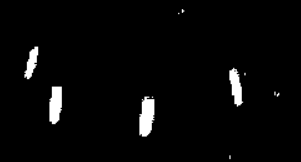
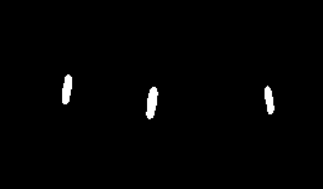
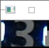
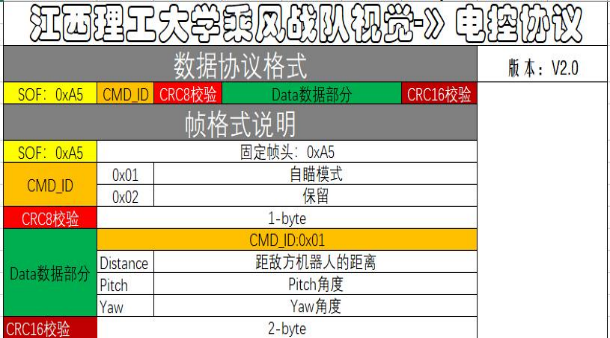
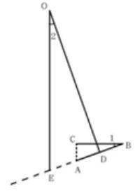
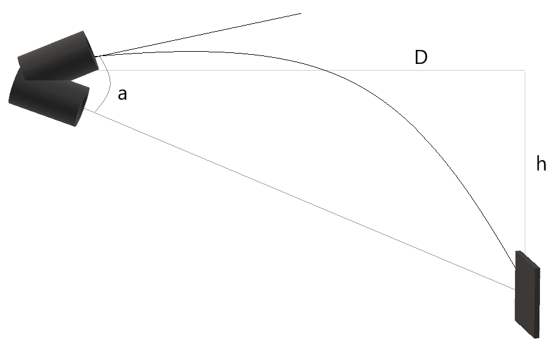
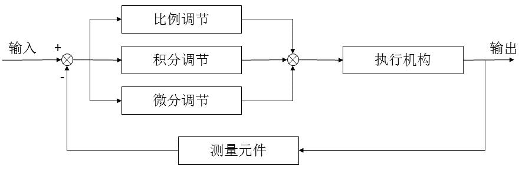

# 英雄视觉方面的调试
## 前言
刚开始尝试写英雄视觉是从了解代码的大概功能开始的，先从老学长留下来的基础代码一行一行的去读，在结合一些网上查找到的资料源码组合得到代码所需要的视觉框架，在通过调用opencv库以及自己所理解的代码逻辑去构建基础代码，再在这个框架上去完善应有的功能，起初在前面啃学长留下来的代码那部分花了太多的时间，为了让你们尽快的熟悉视觉方面的东西，不在其他方面花费时间，下面我会介绍视觉代码整体的框架以及代码的功能，还有一些自己踩过坑后知道的经验。这是代码：[英雄视觉](https://jxlgdx.coding.net/p/shijue/d/hero_/git)
## 代码框架
----main 主函数，调用摄像头，加了usb摄像头热拔插。  
----cam_work 海康威视工业相机驱动。  
----SerialPort 串口通讯，加了串口热拔插。  
----ProgramMain 图像预处理函数，查找并筛选灯条轮廓。  
----Handle 包括PID，弹道模型，反小陀螺。  
----多进程 调用图像处理，串口通讯，数字模型的并行进程，但因为数据共享的延迟性被弃用了，有兴趣的可以尝试，也可以尝试下加了数据锁的多进程，去选择帧率更高的一种方法。  
----数字模型 由于我使用的是将图片数字化输出的方法，导致一帧处理的时间太长，有严重的滞后性，感兴趣的可以自己尝试SVM数字模型或使用其他学校已开源的SVM模型。  
----卡尔曼滤波 用于做预测，由于PID处理时有因为通讯的延后性，使用时会导致静止时也会剧烈的抖动，因此弃用，在将PID做到可以稳定的跟随后可尝试卡尔曼滤波，需要往这方面努力。  

  总体来说我们所用的是传统视觉，传统视觉方面的弊端是由于使用阈值作二值化处理太过于依赖环境，因此在调试过程中不能太依赖于二值化阈值，但是他相对于神经网络的优点是处理效率要相对于快，如果坚持做传统视觉，那么我想到的突破点有两个：1.做出自适应阈值，这个我只在网上看到过思路，但可以去尝试；2.将曝光调到最低，加入gamma矫正，对矫正后的图片做数字识别。当然如果选择做神经网络当然更好，毕竟它准确率相对于传统视觉高，难度肯定也更大。
## 代码讲解
### 主函数
实现摄像头驱动的调用以及图像预处理的调用，由于英雄可以死亡后复活，因此实现摄像头的热拔插很重要。usb摄像头：若摄像头丢失再次调用摄像头调用的函数即可重启摄像头。工业摄像头：工业摄像头不能这样，工业摄像头这样调用会导致开启时间过长（大概20-30s，比赛时间也就几分钟，实在太长了），因此英雄若想上工业摄像头必须去尝试实现摄像头快速热拔插。还可以就是用代码调用脚本，用脚本控制摄像头重启，但是没有尝试过，可以去尝试尝试还有没有其他代码控制的方法。（除了用视觉这边代码启动外还有另一个办法：电控那边将电脑和摄像头的电源线都接到电源管理模块上，但是要注意电脑是19v，摄像头是12v，必要时可以尝试让他们上两个电压转换模块尝试这个方法）。
### 图像预处理
阈值代码框架那里提了一些了，我们现在使用的是rgb通道，当然也可以使用hsv通道，使用hsv通道其实会让轮廓更接近矩形，看你的整体框架用哪种好就选哪种。  


 

```python
h_up_left = 255 - cv2.getTrackbarPos('h_up_left', 'hsv_left')  # 获取 h 通道最大值 （用 255 去减的目的是，减少滑动滚动条）
s_up_left = 255 - cv2.getTrackbarPos('s_up_left', 'hsv_left')  # 获取 s 通道最大值
v_up_left = 255 - cv2.getTrackbarPos('v_up_left', 'hsv_left')  # 获取 v 通道最大值
h_down_left = cv2.getTrackbarPos('h_down_left', 'hsv_left')  # 获取 h 通道最小值
s_down_left = cv2.getTrackbarPos('s_down_left', 'hsv_left')  # 获取 s 通道最小值
v_down_left = cv2.getTrackbarPos('v_down_left', 'hsv_left')  # 获取 v 通道最小值
lower_left = np.array([[h_down_left, s_down_left, v_down_left]])  # 封装好三个通道的最小值，[ h_min, s_min, v_min ]
upper_left = np.array([[h_up_left, s_up_left, v_up_left]])  # 封装好三个通道的最大值，[ h_max, s_max, v_max ]
mask_left = cv2.inRange(frame_hsv_left, lower_left, upper_left)  # 将转化好的 hsv 格式图像，通过hsv阈值提取，转化成二值化图像
```
调阈值的时候必须要熟练，实在不是很会可以把几个二值化后，高斯模糊后的图都调出来，一一比对。同时这里可以加一个ROI区域，ROI区域是限制后面的几帧区域范围位于这一帧识别到的装甲板，这样可以实现跳几帧识别一帧，提高帧率，当然这个要在不造成结果延迟时使用，配合数字识别，提高帧率的同时还提高准确率。  

```python
if L == 1:  # ------------------L=1进入ROI区域，ROI区域定义在该函数最后那块（ROI区域不用识别，直接定义该区域中心为装甲板中心）
          L = 0
          maxCx = int(abs(abs(roix1) - abs(roix2)) / 2 + roix1)
          maxCy = int(abs(abs(roiy1 - h // 2) - abs(roiy2 + h // 2)) / 2) + (roiy1 - h // 2)
```

### 查找并筛选灯条轮廓
先从灯条长宽比，角度，斜率等方面筛选出比较符合条件的灯条（这里条件不能限制太苛刻，计算灯条长宽的方法也有几种，可以用最常用的最小拟合矩形轮廓，但这个方法长宽边是随机的，也可以用直立矩形拟合，这个方法长宽边也是随机的，还可以使用轮廓上下极点去拟合，这个方法在计算角度上会有些许偏差）。
```python
x, y, w, h = cv2.boundingRect(contours[i])  # 几何矩(直立拟合矩形)
cx = x + int(w / 2)
cy = y + int(h / 2)
rect = cv2.minAreaRect(contours[i])  # 计算最小外接矩形（最小去拟合矩形）
box = np.int0(cv2.boxPoints(rect))
(rw, rh) = rect[1]  # 矩形的宽高
if rw>rh:
    t=rw
    rw=rh
    rh=t
cnt = contours[i]
top_most = tuple(cnt[cnt[:, :, 1].argmin()][0])  # 灯条轮廓的最高点（极点）
bottom_most = tuple(cnt[cnt[:, :, 1].argmax()][0])  # 灯条轮廓的最低点
K = (top_most[1] - bottom_most[1]) / (top_most[0] - bottom_most[0])  # 灯条轮廓的斜率
```
再两两匹配，组合出中间没有第三根灯条的一对灯条，在通过每对灯条的长宽比，角度，斜率等方面筛选出比较符合装甲板条件的配对灯条（这里条件就是要自己观察，比如装甲板的配对灯条斜率一样，装甲板的宽基本上是灯条的长度的4-5倍，这个需要自己观察后一一去尝试），最后搭配数字识别得出装甲板以提高准确率。(在这里还要提一点我们的摄像头还是用的usb摄像头，由于在usb摄像头下使用gramma矫正，效果并不是很理想，后续如果要使用gramma矫正的话不建议使用usb摄像头。)
### 串口通讯
串口通讯是视觉与电控的通讯，视觉识别到后，将发射机构需要转动的角度发给电控，由电控那边控制，视觉接收电控发过来的一连串十六进制码，从中根据确定的帧头以及crc校验码提取出有效的一帧，在从这一帧中的数据帧中提取出我们需要的速度，颜色，yaw轴角度，pitch轴角度等数据，我们发送数据同样是把需要发给电控的数据：yaw轴角度，pitch轴角度，角速度，角加速度等转换为数据帧，在插入帧头和crc校验码后以十六进制码发送给电控。

  

  我这边是把我要发送的数据固定为一个列表了，认为这样修改数据麻烦的可以转用队列，由于数据被我们接收后，还会经过处理因此我们传过去的数据是有一些延迟的，会造成什么影响以及解决办法将会在后面的PID中提到。至于串口热拔插在不影响帧率的情况下可以选择使用。
```python
  def TransformData(a,b):   #添加帧头模块以及crc8、crc16到帧数据中为一帧完整的据
          Tdata= [0,0,0,0,0,0,0,0,0,0,0,0,0]
          Tdata[0]=165   #帧头
          Tdata[1]=1    #模块ID
          crc8.append_CRC8_check_sum(Tdata,3)   #crc8校检（检查前面的数据）
          Tdata[3]=a[0] #--------数据帧
          Tdata[4]=a[1]
          Tdata[5]=a[2]
          Tdata[6]=a[3]
          Tdata[7]=b[0]
          Tdata[8]=b[1]
          Tdata[9]=b[2]
          Tdata[10]=b[3]
          crc8.append_CRC16_check_sum(Tdata,13)   #crc16校检
          return Tdata
```
```python
--------------------------------串口热拔插
plist = list(serial.tools.list_ports.comports())  # 获取可用串口列表
if len(plist) <= 0:
    print("没有发现端口!")
    cv2.waitKey(0)
else:
    plist_0 = list(plist[0])
    com = plist_0[0]   #获取串口名
    a = SerialPort(com, 115200)
    a.send_data(0,0)
```      
### 反小陀螺
利用针孔相机模型（D = (W ∗ F)/P [摄像头到物体的距离=物体的真实宽度*摄像头的焦距/物体的像素宽度]）和三角形相似原理根据装甲的倾斜所造成的宽度像素差计算该状态下对应的圆心角度。如下图所示点 O 为相机光轴原点，BC 为投影宽度，AB 为理想正对宽度，二者比值即为所对应圆心角的余弦值。即<1, <1=<2。  



保留位置坐标和角度，记录每两帧间的角度差和移动位置差，根据角度差关系确定置信等级，置信等级达到设定阈值为判断为陀螺的基本要求，在此基础.上增加连续多帧旋转角度的方差计算，将方差和位置记录总次数作为另一判断依据，增加判断和计算的准确性。  
根据所保留的位置坐标的 x 和 z 坐标进行最小二乘拟合，估计对应运动范围截距，根据保留角度极值计算半径和运动圆心，进而完成下一步运动估计。(这个方法尝试过，但由于AB边的斜率不精准，因此效果并不是很好，但是这个原理是可行的，当然也可以选择尝试其他的方法，我建议可以观察灯条与旋转圆心的规律以灯条为条件定小陀螺旋转的中心)。
### 弹道模型
由于英雄弹丸下坠影响力较大，因此弹道模型犹为重要，但是使用 PNP 解算弹道时，在角度方面总会存在一点误差，因此我在经过不断的尝试和踩坑后得到了一个不需要PNP的弹道模型，pitch轴方面就是个物理模型，相当于我把枪口对准装甲板中心后又往上抬了一个受下坠力影响的角度a，而所需要的高度h则是通过距离做相似三角形得到（测距我用的是小孔成像，使用的对照物是灯条的长度，当然如果你可以用PNP求得更精准，还是建议用PNP）。


```python
cypitch=b[3]#当前pitch角度
h3=abs(Od.cxs3(abs(240 - cy), Distance)/100.0)#当前h（Distance为距离）
if cypitch<0 :
    if cy<240:
        h1=-math.atan(((Distance/100.0)*abs(math.tan(cypitch))+h3)/(Distance/100.0))
    elif cy>240:
        h1 = -math.atan(((Distance / 100.0) * abs(math.tan(cypitch)) -h3) / (Distance / 100.0))
    else:
        h1=0
```
yaw轴方面是经过试验，发现yaw轴只需将装甲板的中心与枪口的x轴中心重合即可。
```python
if  cx < 320 and Distance!=0:#---yaw轴
    xw3 = abs(cx - cxmbx)
    if xw3!=0:
        sw3 = Od.cxs(xw3, Distance) / 100.0
        sw3 = sw3 / 100.0
        a3 = (math.atan(sw3 / (Distance / 100.0)) + cxyaw)
    else:
        a3=cxyaw
```

### PID
PID 算法的执行流程是非常简单的，即利用反馈来检测偏差信号，并通过偏差信号来控 制被控量。而控制器本身就是比例、积分、微分三个环节的加和。其功能框图如下：  

    

根据上图我们考虑在某个特定的时刻 t，此时输入量为 rin(t)，输出量为 rout(t)，于是偏差就可计算为。于是 PID 的基本控制规律就可以表示为如下公式：U (t) = kp(err(t )+1/T ∫err(t)dt+Td/dt derr(t)。  
将云台位姿解算与弹道模型算法得到的值作为输入值传给增量式 PID 后，再将输出值通过串口通讯算法传给电控。  
但是无论使用哪种都会出现不可避免的抖动，这是因为数据是先由电控传给我们当前位置姿态，然后经过我们处理在传给他们，前面串口通讯那里也提到经过传输会造成延迟，导致我们还是上个时间的目标时，目标位置姿态已经发生了改变，所以PID会发生抖动。解决办法就是，串口通讯的内容再加一个时间戳，我们收到时间戳后，进入图像处理，在发一个时间戳给电控，由电控那边来控制发射机构的移动以及相关的卡尔曼预测。（当然这个也可以由视觉这边来实现，只要视觉这边得到电控发过来的时间戳后，加上经过图像处理后的时间在加上一个预测传过去需要的时间来计算得出需要移动的位置姿态即可）。
## 最后总结
这版代码其实该有的基础功能都差不多了，相对的问题我也提出了相对性的建议，剩下需要优化的除了一个难弄的阈值方面就是需要不断学习优化的数字模型，PID以及卡尔曼滤波了，可以发现我所有的建议都是建立在不影响帧率的前提下，所以一定要把帧率提高，这很重要，还有最后一点建议，写代码时要记得封装，代码一定要加注释，重要的关键变量记得要备注，在进行测试时最好养成记录测试数据的习惯，这个会有很大帮助的。
