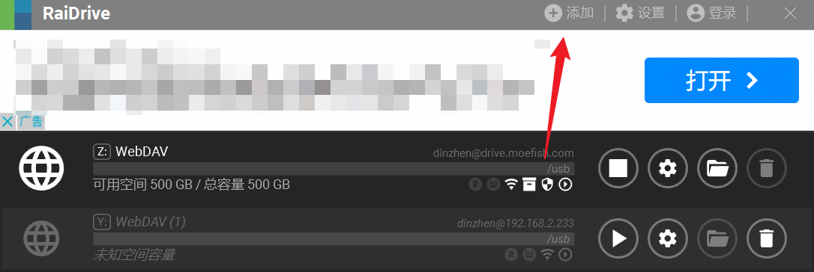
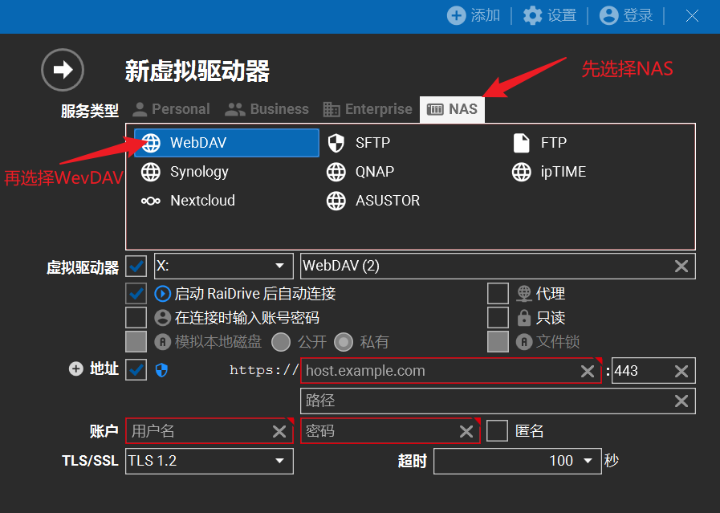
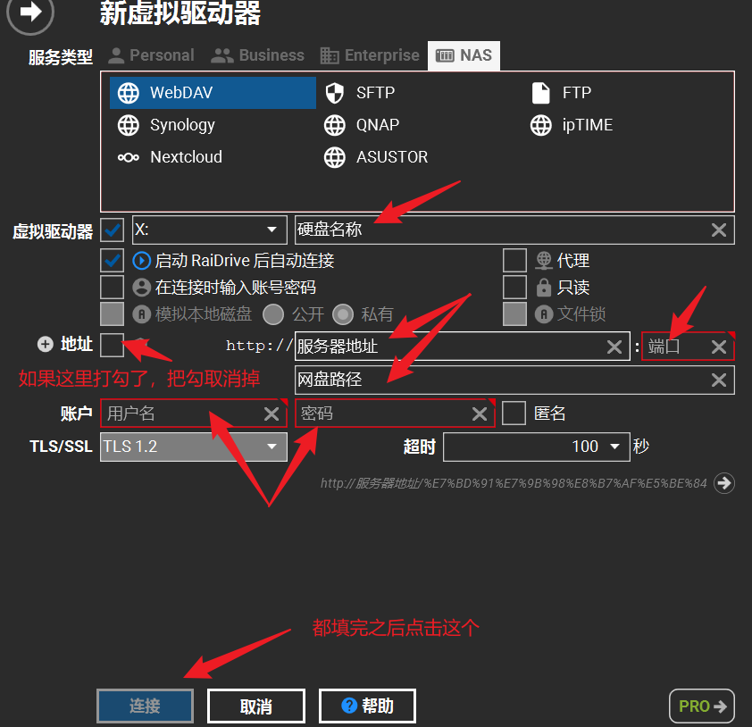
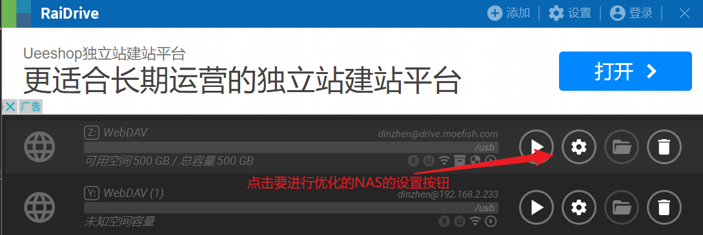
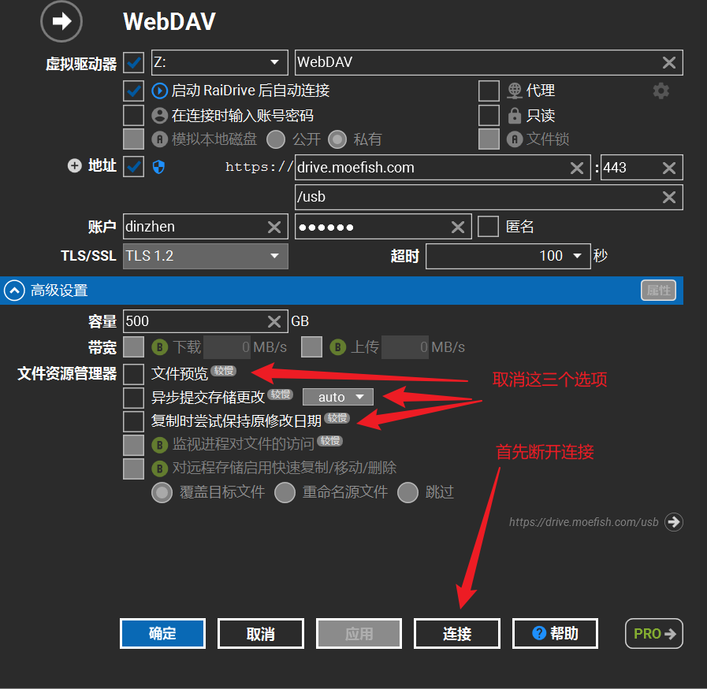

# 如何挂载协会的NAS储存

## 软件准备

  - [RaiDrive](https://app.raidrive.com/d86ea6fa40f74010914976063f94774b/release/stable/RaiDrive_2023.2.55_x64.exe)

  点击以上链接下载并安装
## 在RaiDrive中添加NAS

## 1.点击软件右上角的添加按钮，添加一个节点

## 2.选择WebDAV类型

### 3.1添加内网NAS

:::tip
内网环境下的NAS仅支持**内网访问**(连接协会路由器)
:::
参考下图

其中
- 硬盘名称可以随意填写，比如填写为“内网NAS”
- 将“地址”后面的勾取消
- 服务器地址填写: `192.168.2.233`
- 端口填写: `8888`
- 网盘路径填写: `usb`
- 账户和密码向你的组长索要，一般用户名为你的名字的首字母，密码为随机乱码 

最后点击连接即可

### 3.2添加外网NAS

:::tip
目前外网环境下的NAS受到网络因素影响，速度和延迟都不甚理想
:::

参考  ***3.1添加内网NAS***  中的图片

其中
- 硬盘名称可以随意填写，比如填写为“外网NAS”
- 将“地址”后面的勾打上
- 服务器地址填写: `drive.moefish.com`
- 端口填写: `443`
- 网盘路径填写: `usb`
- 账户和密码向你的组长索要，一般用户名为你的名字的首字母，密码为随机乱码

最后点击连接即可

### 4.（可选）优化外网NAS访问速度

:::tip
本操作可以解决外网NAS环境下右键文件卡死的问题
:::
1.

2.

点击应用后重新连接即可

## 已知问题

  - 由于frp服务器在海外，高延迟使得外网访问NAS的响应时间较慢

