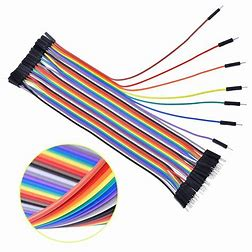

# 电控/智能车入门学习内容
> 由于智能车和RoboMaster前期学习内容一致，所以安排在一起。都是对车的控制，其中包括嵌入式开发、通信、电机选型与驱动以及控制算法等。RM中主控常用STM32F4系列，编程语言为C，使用标准库和HAL库。智能车使用的主控是根据赞助商而定，但入门均需学习51单片机和STM32单片机。

**C语言入门需自行完成以下内容：**
1.  **代码规范**
2. **数据类型**
3. **循环/选择/分支**
4. **函数**
5. **数组**
进阶内容：**指针和结构类型（结构体、共用体）**

**单片机入门内容：**
1. **GPIO**
2. **定时器**
3. **PWM**
4. **外部中断**
5. **串行通信**

# 物资准备
**物资目录：**
名称 | 数量 | 样式
:----------- | :-----------: | -----------:
 51单片机   |     1             |    
STM32F103最小系统板   |     1             | 
杜邦线（公对公、母对母）  |     若干          |    
ST-LINK V2烧录器/J-Link烧录器   |     2选1             |      
SG90舵机   |     1             |      
上述物资协会均有一定的存货，但是数量有限。为了保证大部分的同学能够使用实物学习，可以为在协会学习的同学提供上述物资。

# C语言学习资料
> C语言是理工科的大学必修课，也是电控方向的基础，因为目前C语言是基于单片机的嵌入式开发的主要语言。IDE推荐使用：DEV C++（轻量、简单、便捷），后续将不会使用，只适用于C语言学习阶段。

DEV C++：[DEV C++点此下载](https://sm.myapp.com/original/Development/Dev-Cpp_5.11_TDM-GCC_4.9.2_Setup.exe)
MOOC：[翁凯C语言 B站链接](https://www.bilibili.com/video/BV19W411B7w1?from=search&seid=11888383834642004771&spm_id_from=333.337.0.0)
博客：[c语言入门这一篇就够了-学习笔记(一万字)](https://blog.csdn.net/qq_23079443/article/details/81108901)

上述资料，是我觉得不错的，推荐给大家，大家如果发现了其他好的资料，可以推荐给我。

# 学习规划
> 1. **C语言的概览**（面向过程、优缺点、代码结构）重点看规范文档，掌握各种语句和数据类型(int、float、double、char等)
> 2. **了解各种运算符**（+、-、*、/，~、！、&、#）
> 3. **学习顺序、选择、循环 3种基本程序结构**，掌握if-else、for、while、do-while、switch-case、break、continue等语句的用法，goto有所了解即可。
4. **函数的使用**（自定义函数、参数类型、返回值、局部变量、全局变量）
5. **数组的使用**（字符串、数组遍历）
进阶内容：**指针和结构体**等内容，暂时可以不涉及，但将来一定会用。

# 单片机培养方案
**考核要求**：学会使用51单片机、部分STM32功能。
**软件使用KEIL**：51单片机使用（keil4）、STM32单片机使用（keil5）
**安装顺序（keil5为例）**：

1. 安装MDK-523.exe
2. 安装Keil.STM32F1xx_DFP.1.1.0.pack和Keil.STM32F4xx_DFP.2.12.0.pack
3. 使用破解机破解keil
4. 安装STLINK驱动
5. 安装JLINK驱动（即文件Setup_JLink_V496.exe）使用ST-Link的安装ST-Link的驱动

**学习资料**：
[普中科技51单片机教学](https://www.bilibili.com/video/BV1NW411r7bu?from=search&seid=17989670663215320462&spm_id_from=333.337.0.0)
[正点原子STM32F1系列教程](https://www.bilibili.com/video/BV1kx411k7JT?from=search&seid=3844000692265824719&spm_id_from=333.337.0.0)
本人在CSDN上发布了大部分的STM32的总结博客，有兴趣的同学可以加个关注：[STM32驱动SG90舵机](https://blog.csdn.net/qq_42866708/article/details/113355329)
学习时间建议每三天完成一个功能的学习（包含理论、代码尝试、实际操作）
